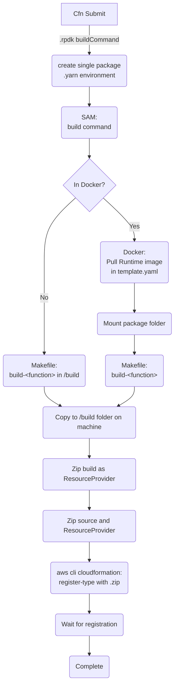

# Developing

Since the cfn typescript plugin was prebuilt to use npm, this template is created to make use of the same plugin, but with yarn plug'n'play as a consideration.

In order to do this we make use of a few tools:

- make
- node version 18 and `corepack enable`
- yarn berry
- [prod install plugin](https://gitlab.com/Larry1123/yarn-contrib/-/raw/master/packages/plugin-production-install/bundles/@yarnpkg/plugin-production-install.js)
- AWS Cloudformation CLI (and by extension the AWS SAM CLI)
- tar command line utility
- Docker

## The Cloudformation CLI build process

In all honesty, the cloudformation cli is TOO magic.  However, it does do some valuable abstractions
that would be a pain to QA.  Therefore, we provide this diagram to show what the cloudformation CLI is
doing in conjunction with our project. 



### About:

The Cloudformation CLI is orchestrating the ingestion of the `.rpdk-config` file and it's usage in the 
extension tool.  In our case, since we are using yarn and monorepos, we supply an overriding `buildCommand`
that does a few things.  

1. For Docker building (and in anticipation of monorepos), we make sure to create a .yarn folder and environment
that replicates the current package's dependencies in order for our normal yarn scripts to work.

2. We also override our SAM CLI command to have a few extra parameters for our Makefile to detect being built in
docker (`-e IN_DOCKER=true` in `yarn sam-build-docker`)

After setting up those pieces, in the recommended processing flow, we end up buiding in docker (see below if you want to risk building wrong platform dependencies.).

The SAM CLI pulls down the corresponding lambda runtime image that we specify in the template.yml file.  It also
mounts our package directory to our container and then calls the corresponding function build command.

From here, the Makefile can be examined for further specificity but it predominantly does:

1. copying the .yarn folder we created into the root level
2. Installing yarn and ensuring it's packages are built for the OS via `yarn install`
3. Building via your desired build method
4. Packing the package
5. unzipping the package to the out directory so that SAM can add a few other template files

At this point, SAM takes over and copies the output to the `./build` folder in your file system.

After that, the cloudformation CLI creates a .zip of the SAM build and then zips that with the source
and then submits that on our behalf to the cloudformation CLI.

**Note:** Implicit in this submission is that we are creating an S3 bucket and uploading the zip as well as
creating the correct role for the S3 bucket to be accessed by the registry (this is why we use the CLI here)

## Makefile

The makefile provided provides two different sets of build instructions depending on your needs:

1. esbuild-flow
2. yarn-pnp-flow

### esbuild-flow

This flow is the ideal flow since it will simply use esbuild to build the handlers.ts file into a single
compact handlers.js output that runs. This is ideal for most implementations except where you would need
to somehow maintain file structure due to some library that does not play well with code bundlers.

### yarn-pnp-flow

This flow makes use of the yarn [prod install plugin](https://gitlab.com/Larry1123/yarn-contrib/-/raw/master/packages/plugin-production-install/bundles/@yarnpkg/plugin-production-install.js)

**Note:** This plugin serves its purpose but is not actively maintained, you may change it out for something
that does equivalent functionality in the makefile that calls `yarn prod-install`

```shell
yarn plugin import https://gitlab.com/Larry1123/yarn-contrib/-/raw/master/packages/plugin-production-install/bundles/@yarnpkg/plugin-production-install.js
```

This flow will create a small bundled library (compatible with monorepos) with a yarn cache and .pnp.js file.
It will also bring your entire pack in and then ensure that the entry file (handlers.js) imports the .pnp.js file.

### Choosing your build flow

The SAM template.yaml is already set up to work out of the box for you by referencing the makefile as a custom runtime. If you want to change your build flow, you need to change the implementation for:

- build-TypeFunction
- build-TestEntrypoint
- build-<any other function name>

#### Updating Scripts for plug'n'play build

If you are switching to yarn plug'n'play, you will be running off of the yarn node packages and typescript build output instead of tightly
compiled esbuild output.  As a necessary part of this, you will want to change the general `yarn build` script to call `yarn ts-build`.

This will allow any debugging operations to reference the same code when using things like build-for-debug, etc.

#### If you want to not use Docker for building

Note: it is not recommended to skip using docker since that should install all packages for the linux distro
that AWS expects this to be run with. However, if you want to change that, you can:

1. change the .rpdk-config settings for docker
2. change the buildCommand to use `yarn sam-build` instead of `yarn sam-build-docker`
3. change the `build-for-debug` command to also  remove the appropriate parameters in the case of debugging

# IDE support

For yarn plug'n'play, you need to install your appropriate [editor sdk](https://yarnpkg.com/getting-started/editor-sdks/). For convenience, this repo includes a working config with VSCode.

You will still need to call `cmd + p -> Select Typescript Version`

# Using Layers

This template provides an example lambda layer that you might want to install for your application to be able
to call aws cli (particularly useful for some kubernetes operations).  The template.yml has the commented out 
declaration of that layer so that you can try uncommenting, building it, and then associating it with your 
function if you so choose.

Please see the README in that folder for a better understanding of what the layer is doing.

If you do not want to use layers, please remove the folder and the commented example in template.yml.

## Testing Layers

There is a  package script `test-layers` which basically calls `bin/test-layers.sh`.  This simple test script 
has a few expectations about a set of layer tests that it is trying to call:

1. The function will only return `SUCCESS` if it has succeeded to the end
2. The function (and only layer test functions) will be named something like `LayerTest`

This type of setup is ideal for compartmentalizing failure modes and ensuring that layers were functioning
in a very simple lambda before being used elsewhere.

If you are using layers, you should make sure to call this test first in your test pipeline.

# Testing builds

If you would like to test building your resource and you are using the Docker method (recommended), you will
more than likely want to use the `--skip-pull-image` flag.  Without this flag, you will download the lmbda image
every time you run build which will make testing build configurations extremely lengthy.

# Running Locally

In order to test your lambda locally, you can use example_inputs and invoke the created function.  If you are 
just looking to black box run your resource provider, you can simply build and run your production lambda from
its `TestEntrypoint` or the `TypeFunction` with a more complete response.

To understand payloads for sending, please see the [example_inputs Readme](./example_inputs/README.md).

```shell
# Non-debuggable running commands
# Build the sam function
yarn sam-build-docker

# Invoke the function
yarn invoke:TestEntrypoint --event example_inputs/inputs_1_create.json
```

The above script abstracts away a lot of functionality.  You can take a look at the actual sam parameters that are being set.

## Local Environment

One of the key things that we bake into the invoke script is the ability to declare local environment variables.  We do this by including
the `local-env.json` file during these runs.

This is particularly valuable for locally testing connections to a local environment and [localstack](https://docs.localstack.cloud/getting-started/).
Particularly, we have included a conditional script in the handler that will take the LOCALSTACK_URL environment variable and configure all aws clients
to point to a localstack endpoint.

If you are going to use localstack, the defaults are set up to use localstack in the same Docker daemon as the lambda that sam brings up.  You will still
need to set up your own development scripts, however, to bring up and down localstack.  As well as cleaning any resources that you may make in localstack.

## Debugging

For the sake of ease, this project provides a way for you to attach the VSCode Debugger or another debugger when running
things via the SAM cli.

To do this, we provide a script:

```shell
yarn build-for-debug
```

This script will rebuild both your local `dist` and your `build` directories (where SAM pulls from) with debug settings and
source maps enabled. The reason for building the `dist` directory is because we currently don't have sourcemaps configured
to reference from the build directories of SAM. Please feel free to make that addition to the esbuild configuration, for now
this circumvents the need to test that.

Once you have built for debug, you can start a sam session as debuggable with either some of the scripts in package.json or by simply
doing a sam cli call:

Two scripts are provided as base points for tweaking:

```shell
yarn invoke-for-debug:TestEntrypoint --event example_inputs/inputs_1_create.json
yarn invoke-for-debug:TypeFunction --event example_inputs/inputs_1_create.json
```

Keep in mind that the values in the above scripts are the minimum configuration parameters for your lambda function to invoke appropriately.
You should not remove the options without fully understanding them, but feel free to abstract them as you see fit.

### Examing the TestEntrypoint script

If you do look at the `invoke-for-debug:TestEntrypoint`, you can see that the resultant sam command from above looks like:

```shell
sam local invoke TestEntrypoint -d 9888 --parameter-overrides BuildType=Debug  --event example_inputs/inputs_1_create.json
```

#### -d parameter

This parameter must match your 'attach to remote debugger' configuration port and you must attach your debugger in order to
start the run.

#### --parameter-overrides

We use a parameter in the [template.yml](./template.yml) so that we can control things like memory size for debugging versus prod.
The BuildType Parameter influences the `DebugMode` condition and is used to change relevant values. If you are adding something
that could be compromised when running a non-production packed set of code (like memory), you may want to use this condition in your
template as well, to ensure that your debug does not get `sigkill` due to OOM or other infra errors when running.

### Configuring your IDE for debugging

When using VSCode, the configuration for this type of entrypoint testing is as follows:

**Note:** There are several entrypoints in the template.yaml and it would be prudent to configure 1 debug point for each that you make.

```json
    {
      "name": "Attach to SAM",
      // This is the port that you will be attaching to
      "port": 9888,
      "request": "attach",
      "skipFiles": [
        "<node_internals>/**"
      ],
      // This is where the sam lambda has put the function in question
      "remoteRoot": "/var/task/build/TestEntrypoint/dist/",
      // This is the local root that mirrors the code we built
      "localRoot": "${workspaceFolder}/packages/test-resource/dist",
      "type": "node"
    },
```

# Tutorial

There is a pretty helpful introduction to typescript plugin development [here](https://aws.amazon.com/blogs/mt/introducing-typescript-support-for-building-aws-cloudformation-resource-types/)
