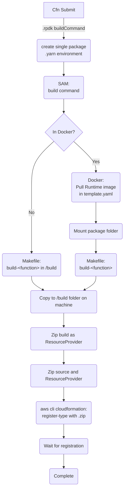

# Developing

Since the cfn typescript plugin was prebuilt to use npm, this template is created to make use of the same plugin, but with yarn plug'n'play as a consideration.

In order to do this we make use of a few tools:

- make
- node version 18 and `corepack enable`
- yarn berry
- [prod install plugin](https://gitlab.com/Larry1123/yarn-contrib/-/raw/master/packages/plugin-production-install/bundles/@yarnpkg/plugin-production-install.js)
- AWS Cloudformation CLI (and by extension the AWS SAM CLI)
- tar command line utility
- Docker
- localstack for local testing

## The Cloudformation CLI build process

In all honesty, the cloudformation cli is TOO magic. However, it does do some valuable abstractions
that would be a pain to QA. Therefore, we provide this diagram to show what the cloudformation CLI is
doing in conjunction with our project.



### About:

The Cloudformation CLI is orchestrating the ingestion of the `.rpdk-config` file and it's usage in the
extension tool. In our case, since we are using yarn and monorepos, we supply an overriding `buildCommand`
that does a few things.

1. For Docker building (and in anticipation of monorepos), we make sure to create a .yarn folder and environment
   that replicates the current package's dependencies in order for our normal yarn scripts to work.

2. We also override our SAM CLI command to have a few extra parameters for our Makefile to detect being built in
   docker (`-e IN_DOCKER=true` in `yarn sam-build-docker`)

After setting up those pieces, in the recommended processing flow, we end up buiding in docker (see below if you want to risk building wrong platform dependencies.).

The SAM CLI pulls down the corresponding lambda runtime image that we specify in the template.yml file. It also
mounts our package directory to our container and then calls the corresponding function build command.

From here, the Makefile can be examined for further specificity but it predominantly does:

1. copying the .yarn folder we created into the root level
2. Installing yarn and ensuring its packages are built for the OS via `yarn install`
3. Building via your desired build method
4. Packing the package
5. unzipping the package to the out directory so that SAM can add a few other template files

At this point, SAM takes over and copies the output to the `./build` folder in your file system.

After that, the cloudformation CLI creates a .zip of the SAM build and then zips that with the source
and then submits that on our behalf to the cloudformation CLI.

**Note:** Implicit in this submission is that we are creating an S3 bucket and uploading the zip as well as
creating the correct role for the S3 bucket to be accessed by the registry (this is why we use the CLI here)

## Makefile

The makefile provided gives two different sets of build instructions depending on your needs:

1. esbuild-flow
2. yarn-pnp-flow

### esbuild-flow

This flow is the ideal flow since it will simply use esbuild to build the handlers.ts file into a single
compact handlers.js output that runs. This is ideal for most implementations except where you would need
to somehow maintain file structure due to some library that does not play well with code bundlers.

### yarn-pnp-flow

This flow makes use of the yarn [prod install plugin](https://gitlab.com/Larry1123/yarn-contrib/-/tree/master/packages/plugin-production-install)

**Note:** This plugin serves its purpose but is not actively maintained, you may change it out for something
that does equivalent functionality in the makefile that calls `yarn prod-install`

```shell
yarn plugin import https://gitlab.com/Larry1123/yarn-contrib/-/raw/master/packages/plugin-production-install/bundles/@yarnpkg/plugin-production-install.js
```

This flow will create a small bundled library (compatible with monorepos) with a yarn cache and .pnp.js file.
It will also bring your entire pack in and then ensure that the entry file (handlers.js) imports the .pnp.js file.

### Choosing your build flow

The SAM template.yaml is already set up to work out of the box for you by referencing the makefile as a custom runtime. If you want to change your build flow, you need to change the implementation for:

- build-TypeFunction
- build-TestEntrypoint
- build-<any other function name>

#### Updating Scripts for plug'n'play build

If you are switching to yarn plug'n'play, you will be running off of the yarn node packages and typescript build output instead of tightly
compiled esbuild output.  As a necessary part of this, you will want to change the general `yarn build` script to call `yarn ts-build`.

This will allow any debugging operations to reference the same code when using things like sam-build-docker:debug, etc.

#### If you want to not use Docker for building

Note: it is not recommended to skip using docker since that should install all packages for the linux distro
that AWS expects this to be run with. However, if you want to change that, you can:

1. change the .rpdk-config settings for docker
2. change the buildCommand to no longer set the `-e IN_DOCKER=true` environment variable and remove `make create-yarn-wrap` to speed up the build
3. add a `sam-build:debug` command that replaces `sam-build-docker:debug` and remove the appropriate parameters in the case of debugging

# IDE support

For yarn plug'n'play, you need to install your appropriate [editor sdk](https://yarnpkg.com/getting-started/editor-sdks/). For convenience, this repo includes a working config with VSCode.

You will still need to call `cmd + p -> Select Typescript Version`

# Using Layers

If you are familiar with Lambda and Lambda Layers, you will need to discard the idea of lambda layers for resource providers.
This is because resource providers bundle just a .zip file that is run and do not composite lambda layers into a lambda function.

You more than likely still need to install certain things like binaries.  For that, we set up a `lambda-bin` folder as part of
the package.json that is packed and then can write several makefile commands to install different tools to that folder.

The resource handler then can reference these tools by using the tools that you have placed in this folder on build.  You can see
an example of how we use `const LAMBDA_BIN_PATH = resolve(__dirname, '..', 'lambda-bin')` in [handlers.ts](./src/handlers.ts)

## Example: Kubectl

The Makefile that we provide has a command in it `install-kubectl`.  When you examine the command, you can see that the
command will run the normal install of kubectl and then install it to the `lambda-bin` directory during the build.

This installation command should be called before the `pack` command in the esbuild-flow or pnp-build-flow so that
the pack can include it (it is listed in the files field of package.json).

From this pattern, you can write however many commands that you need to get and install tools to that binary path.
The only caveat is that you will need to make sure that your uses of these tools calls them in the lambda-bin folder in 
your scripts.

### Do this in Docker

One thing to keep in mind for any tools that you are installing is that you will want to make sure that you only
build your functions in docker (i.e. `yarn sam-build-docker`).  If you do not do this, you run the risk of installing
binary tools that are Mac/Windows specific instead of Linux.

# Submitting/Generating

We provide a script for publishing the extension to your local aws account `yarn submit:private`.  The name private
helps denote that this will not register your extension to the public registry.

## Examining submit:private

If you examing the submit:private script, you will see that we run `cfn generate` and `cfn submit --set-default`.  This is 
because we need to make sure your schame json has affected the auto-generated `resource-role.yaml` and `models.ts` so that
we don't use an out-of-date build.  Additionally, we use the `--set-default` option so that every new submission becomes the
default.  If this is not what you would like to do, then you can remove the flag and will need to manually update the default

## Testing a submission

If you look at the [README in example_cfn](./example_cfn/README.md), you can update a cloudformation stack template to deploy your
resource.  Using the readme in that folder, you can deploy the cloudformation stack after a valid submission to verify things like:

* iam permissions for the handler
* drift detection
* resource deletion

# Publishing publically

If you would like to publish your privately tested extension, you can follow and add scripts according to [this link](https://docs.aws.amazon.com/cloudformation-cli/latest/userguide/publish-extension.html).

In the future, we may templatize this to be an abstracted script.

# Running Locally

**NOTE** From initial configuration, all `start-lambda` and `invoke` scripts in our package.json set the parameter
`Endpoint=Local`.  This will provide a LOCALSTACK_URL that will override endpoints.  If you would like to change this
for environment testing, you can remove the parameter override for your runs.

# Invoking with a payload

In order to test your lambda locally with a single invoke, you can use invoke and invoke the created function.  If you are 
just looking to black box run your resource provider, you can simply build and run your production lambda from
its `TestEntrypoint` with a `_test.json` file or the `TypeFunction` with the more complete non `_test` postfixed json.

To understand payloads for sending, please see the [invoke_inputs Readme](./invoke_inputs/README.md).

Additionally, if you need to add parameterized data (like your AWS terminal creds to test against an environment),
we provide a `create-event` script that references the [create-event.ts](./src/tools/create-event.ts) typescript file.
You can augment this file if there are more complex configurable inputs that you'd like to add.

The following is an example invoke pattern:

```shell
# Non-debuggable running commands
# Build the sam function
yarn sam-build-docker

# Invoke the function with the current terminal creds
yarn create-event -e invoke_inputs/inputs_1_create_test.json --useAwsEnv | yarn invoke:TestEntrypoint --event -
```

The above script abstracts away a lot of functionality.  You can take a look at the actual sam parameters that are being set.

## Running server for `cfn test`

The cloudformation cli runs contract tests based off of your resource type when you run `cfn test`.  It does this by expecting
that a local lambda is up and running with connections to an AWS environment.  We provide two scripts to help with this type of 
running against local infra (see below for the debug configurations and local stack configs.  Note, you can always try running against
a test AWS account as well).

```shell
# This will create a locally running lambda
yarn start-lambda

# This will create a locally running lambda that is waiting for a remote debugger
# Make sure to have built for debugging
yarn start-lambda:debug
```

After you have the server up, with debug points or not, you can run `cfn test` to validate your tests.

**Note: See the `inputs` folder to make sure you are using the correct payload for `cfn test`**

## Local Environment

One of the key things that we bake into the invoke/start-lambda script is the ability to declare local environment variables.  We do this by 
conditionally providinga `Global:Environment:Variables` section in the template.yaml.  You can see with our LOCALSTACK_URL environment variable 
that we only supply a docker host domain in expectation of localstack being up on the same docker daemon.  You can do the same with other 
environments that you want to set for local runs.

Note: you have to build the template if you add a new parameter but then all environment configurations are based off of the `parameter-override` that
you supply during a sam invoke/start-lambda operation.

Currently these local enviroment variables are valuable for local testing connections to a local environment and [localstack](https://docs.localstack.cloud/getting-started/).

If you are going to use localstack, the defaults are set up to use localstack in the same Docker daemon as the lambda that sam brings up.  You will still
need to set up your own development scripts, however, to bring up and down localstack.  As well as cleaning any resources that you may make in localstack.

## Debugging

For the sake of ease, this project provides a way for you to attach the VSCode Debugger or another debugger when running
things via the SAM cli.

To do this, we provide a script:

```shell
yarn sam-build-docker:debug
```

This script will rebuild both your local `dist` and your `build` directories (where SAM pulls from) with debug settings and
source maps enabled. The reason for building the `dist` directory is because we currently don't have sourcemaps configured
to reference from the build directories of SAM. Please feel free to make that addition to the esbuild configuration, for now
this circumvents the need to test that.

Once you have built for debug, you can start a sam session as debuggable with either some of the scripts in package.json or by simply
doing a sam cli call:

Two scripts are provided as base points for tweaking via simple example input invokes:

```shell
yarn create-event -e invoke_inputs/inputs_1_create.json --useAwsEnv | yarn invoke-for-debug:TestEntrypoint --event -
yarn create-event -e invoke_inputs/inputs_1_create.json --useAwsEnv | yarn invoke-for-debug:TypeFunction --event -
```

Keep in mind that the values in the above scripts are the minimum configuration parameters for your lambda function to invoke appropriately.
You should not remove the options without fully understanding them, but feel free to abstract them as you see fit.

### Running specific tests from cfn test

If you start failing tests during `cfn test`, you will proabably want to debug the specific failures using the following section.  However,
if you just use `cfn test` your development cycle and certainty will be drastically impeded by waiting for all the other tests to run.

In order to solve this, you can take advantage of the undocumented fact that `cfn test` will pass positional arguments to pytest.

#### Example - choosing just one test to run:

Let's say that we got the failure for the test: 

```shell
FAILED ../../../../../private/var/folders/kk/q1njcf452q3f0fmbkgfrd3mm0000gn/T/resource/handler_create.py::contract_create_delete - AssertionError: status should be SUCCESS
```

We can select this test by it's name `contract_create_delete` using the pytest `-k` flag:

```shell 
cfn test -- -k contract_create_delete
```

Simple as that!

### Debugging cfn test or a running lambda server

You can additionally run the lambda server with a debugger.  This is particularly valuable if troubleshooting your `cfn test` results so you
can see what exactly is happening.

For that we provide:

```shell
# Must have built for debug
yarn start-lambda:debug
```

**Note** - when running the start-lambda:debug command, you will need to attach after every request is sent.

### Examining the TestEntrypoint script

If you do look at the `invoke-for-debug:TestEntrypoint`, you can see that the resultant sam command from above looks like:

```shell
sam local invoke TestEntrypoint -d 9888 --parameter-overrides BuildType=Debug Endpoint=Local  --event -
```

#### -d parameter

This parameter must match your 'attach to remote debugger' configuration port and you must attach your debugger in order to
start the run.

#### --parameter-overrides

We use a parameter in the [template.yml](./template.yml) so that we can control things like memory size for debugging versus prod.
The BuildType Parameter influences the `DebugMode` condition and is used to change relevant values. If you are adding something
that could be compromised when running a non-production packed set of code (like memory), you may want to use this condition in your
template as well, to ensure that your debug does not get `sigkill` due to OOM or other infra errors when running.

### Configuring your IDE for debugging

When using VSCode, the configuration for this type of entrypoint testing is as follows:

**Note:** There are several entrypoints in the template.yaml and it would be prudent to configure 1 debug point for each that you make.  We have committed a sufficient starting point in .vscode/launch.json

```json
    {
      "name": "Attach to SAM",
      // This is the port that you will be attaching to
      "port": 9888,
      "request": "attach",
      "skipFiles": [
        "<node_internals>/**"
      ],
      // This is where the sam lambda has put the function in question
      "remoteRoot": "/var/task/build/TestEntrypoint/dist/",
      // This is the local root that mirrors the code we built
      "localRoot": "${workspaceFolder}/packages/test-resource/dist",
      "type": "node"
    },
```

# Tutorial

This repo is a hardening of the concepts introduced in the helpful introduction to typescript plugin development [here](https://aws.amazon.com/blogs/mt/introducing-typescript-support-for-building-aws-cloudformation-resource-types/)

**Note** - This blog article is drastically oversimplified.  Please use it for familiarity and then come back to this repo and its abstractions.
